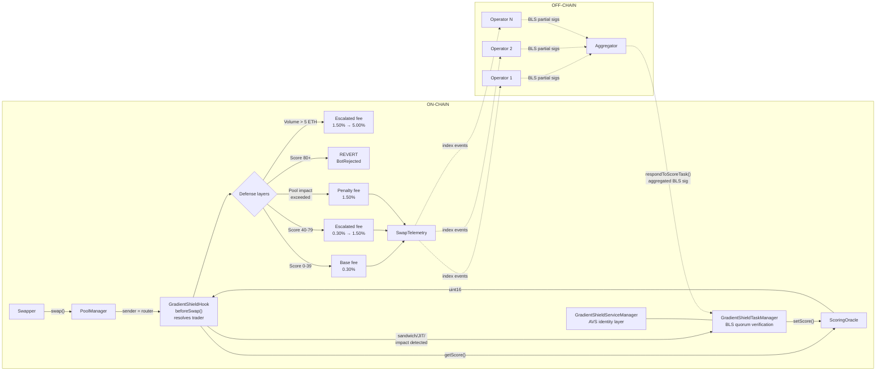
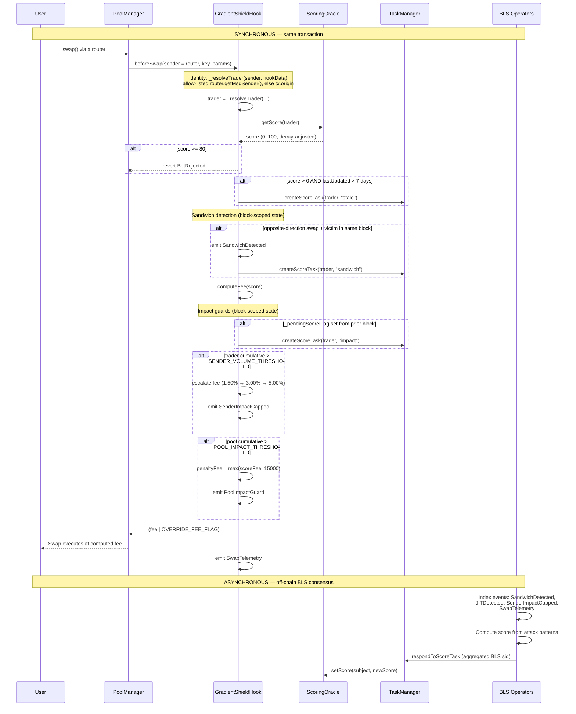

# GradientShield

A Uniswap v4 hook that prices swaps by the swapper's MEV-risk score, enforced by
a BLS multi-operator quorum through an EigenLayer AVS. Suspicious swappers pay an
escalated fee via a continuous fee curve; confirmed toxic flow is rejected outright.

Five defense layers work together to prevent MEV — including **same-block impact
guards** that make sandwich attacks expensive on the very first trade, before any
score exists.

# Project Number : HK-UHI10-1050

> **241 tests passing, 0 skipped** across 19 test suites. Hook logic, BLS quorum
> verification with real BN254 aggregate signatures, oracle decay, sandwich/JIT
> detection, impact guards, hookData attestation, multi-hop ERC6909 settlement,
> access control, edge cases, and the full escalation flow are implemented and
> tested — plus a live end-to-end demo on anvil.

---

## Five defense layers

GradientShield doesn't rely on a single mechanism. Five layers work together so
that even a brand-new address attempting its first sandwich attack is caught and
penalized:

| Layer | When it acts | What it does |
|:-----:|:------------:|--------------|
| **1. Trader Volume Fees** | Same block (first trade) | Tracks per-**trader** volume per pool per block (routers are not identities). Past **5 ETH** the fee escalates: 1.50% (5-10 ETH), 3.00% (10-20 ETH), 5.00% (20+ ETH) — making the back-run progressively unprofitable while keeping the system **fully permissionless**. |
| **2. Pool Impact Guard** | Same block (first trade) | Tracks cumulative volume across all traders per pool per block. When total volume exceeds **10 ETH**, subsequent swaps pay a **1.50% penalty fee**, making the back-run unprofitable. |
| **3. Sandwich/JIT Detection** | Same block | Uses **block-scoped on-chain state** to detect same-block buy→victim→sell patterns and same-block add→swap→remove JIT liquidity. Emits detection events and auto-triggers AVS scoring tasks. |
| **4. Continuous Fee Curve** | Every swap | Maps the trader's **0-100 risk score** onto a fee: clean (0-39) pays 0.30%, suspicious (40-79) pays up to 1.50%, confirmed toxic (80+) is rejected outright. |
| **5. AVS Scoring (BLS Quorum)** | Asynchronous | EigenLayer operators read on-chain detection events, compute scores independently, reach BLS consensus, and write the verified score to the oracle — affecting all future swaps. |

**Key insight:** Layers 1-3 act on the *first ever* trade. No reputation history
needed. Layer 4-5 build long-term memory so repeat offenders face escalating
fees and eventual rejection.

---

## How the first sandwich attack is stopped

```
Block N:
  1. Bot front-runs: buys 4 ETH of token → cumulative = 4 ETH (base fee)
  2. Victim swaps: normal trade proceeds at base fee
  3. Bot back-runs: sells 4 ETH → cumulative = 8 ETH > 5 ETH threshold
     → pays 1.50% fee (tier 1) — eats most of the sandwich profit
     → SenderImpactCapped event emitted, _pendingScoreFlag set

Block N+1:
  4. Bot tries any swap → hook sees _pendingScoreFlag is set
     → auto-triggers AVS scoring task (ScoreTaskTriggered)
  5. AVS operators read SenderImpactCapped event → score +30-35
     Bot enters suspicious band, pays escalated fees going forward
```

The sandwich is made **unprofitable rather than impossible** — the back-run
still executes (the pool stays permissionless) but pays 5x the base fee, which
eats the extracted spread. No score history, no oracle lookup, no off-chain
delay. The threshold is enforced by block-scoped storage at ~2.9k gas per update
after the first swap in a pool.

This is verified against a live chain, not just in tests — see
[Running the live demo](#running-the-live-demo).

---

## Architecture & data flow



### What happens when a user submits a trade



---

## Continuous fee curve

The hook maps a **continuous 0-100 risk score** onto a **linear fee curve**:

```
fee = BASE_FEE + (MAX_ESCALATED_FEE - BASE_FEE) × (score - 40) / (80 - 40)
```

| Score | Band | Fee (pips) | Behaviour |
|:-----:|:----:|:----------:|-----------|
| **0-39** | Clean | 3000 (0.30%) | Base fee |
| **40** | Suspicious (low) | 3000 (0.30%) | Curve entry |
| **50** | Suspicious | 6000 (0.60%) | 2x base |
| **60** | Suspicious | 9000 (0.90%) | 3x base |
| **75** | Suspicious (high) | 13500 (1.35%) | 4.5x base |
| **80-100** | Confirmed toxic | — | **Reverts** `BotRejected` |

---

## Trader identity: who actually gets scored

Every fee, score, detection and volume budget is attributed to the **trader** —
never to the router.

This is not cosmetic. Uniswap v4 passes `beforeSwap` whoever called
`poolManager.swap()`, which in practice is a router. Keying on that address
collapses everyone behind a shared router into a single identity, and the
consequences are severe:

- An honest user **inherits a bot's per-block volume** and pays its penalty fee.
- The router itself **accumulates score** until it crosses the reject threshold,
  at which point `BotRejected` bricks the pool for every user behind it.

`_resolveTrader` resolves identity in this order:

| # | Source | When it applies |
|:-:|--------|-----------------|
| 1 | `ITrustedRouter.getMsgSender()` on the router | Router is on the allow-list. Preferred, because it leaves `hookData` free for the signed score attestation. |
| 2 | Originator the same trusted router wrote into `hookData` | For routers that can forward bytes but cannot add a getter. |
| 3 | `tx.origin` | Everything else — the EOA that signed the transaction. |

Paths 1 and 2 are the only ones that stay correct under ERC-4337, where
`tx.origin` is the bundler rather than the account.

### The allow-list is the load-bearing part

```solidity
if (trustedRouters[sender]) {
    try ITrustedRouter(sender).getMsgSender() returns (address user) {
        if (user != address(0)) return user;
    } catch { /* fall through */ }
    ...
}
return tx.origin;
```

Anyone can deploy a contract that calls the PoolManager directly, which makes
that contract the `sender` the hook receives. If the hook called
`getMsgSender()` on it unconditionally, the contract could return **any address
at all** — naming a clean address to launder its own reputation, or an innocent
one to get it penalised. So `sender` is never trusted until the owner has vetted
it. `test_getMsgSender_unauthorizedRouterIsNeverCalled` drives exactly this
attack and shows it fails.

Three further properties, each with a test:

- **The call is a STATICCALL** (the interface method is `view`), so a
  trusted-but-buggy router cannot mutate state or re-enter. A getter that tries
  to write is rejected and the hook falls back.
- **It is wrapped in try/catch**, so a router that reverts, runs out of gas, or
  does not implement the interface degrades to the next path instead of failing
  the swap.
- **An unknown router is not rejected — it falls through to `tx.origin`.**
  Reverting on an unrecognised sender (`revert("SenderNotAuthorized")`) is the
  obvious-looking move, but it would make the pool **permissioned**: only
  allow-listed routers could trade. This hook stays permissionless, so an
  unvetted router simply gets the weaker identity signal.

> **On `tx.origin`:** it is used here for *attribution and pricing*, never for
> authorization, so the usual phishing objection does not apply — the worst case
> is that an address is charged for a swap its own signature authorised. It also
> cannot be forged without the victim's private key.

The owner's only power is marking routers as originator-forwarding. It cannot
set scores, change fees, reject addresses, or move funds, and can be renounced
with `renounceOwnership()`.

What this buys, measured live (see [the demo](#running-the-live-demo)) with a bot
and a victim trading through **the same router in the same block**:

```
  bot     buy     4.0 -> 10500 pips (1.05%)  <-- penalised
  victim  buy     1.0 ->  3000 pips (0.30%)
  bot     sell    4.0 -> 15000 pips (1.50%)  <-- penalised

  Flagged for sandwiching: bot
  router score = 0
```

`test/TraderIdentity.t.sol` covers this — both original failure modes, the
`getMsgSender()` allow-list, revoked routers, reverting and state-mutating
getters, and spoofing attempts from unvetted senders.

---

## Impact guards (first-trade protection)

These guards use **block-scoped storage** and act on the very first trade — no
reputation history needed.

### Sender volume progressive fees

- **Constant:** `SENDER_VOLUME_THRESHOLD = 5 ether`
- Tracks cumulative `abs(amountSpecified)` per sender per pool per block
- **Never reverts** — the system is fully permissionless, anyone can trade any amount
- Instead, fees escalate progressively:

| Cumulative Volume | Fee Tier | Fee |
|:-:|:-:|:-:|
| 0 – 5 ETH | Base | 0.30% |
| 5 – 10 ETH | Tier 1 | 1.50% |
| 10 – 20 ETH | Tier 2 | 3.00% |
| 20+ ETH | Tier 3 | 5.00% |

- Makes the back-run leg of a sandwich progressively unprofitable
- Independent per sender — one sender's volume doesn't affect another's
- Resets automatically each block (entries are stamped with the writing block)

### Pool impact guard

- **Constant:** `POOL_IMPACT_THRESHOLD = 10 ether`
- Tracks cumulative volume across *all* senders per pool per block
- When exceeded, subsequent swaps pay `IMPACT_FEE_TIER1` (15000 pips = 1.50%)
- Does not revert — applies a penalty fee instead
- Makes large-volume manipulation unprofitable even when split across addresses

### Pending score flag (`_pendingScoreFlag`)

When a sender exceeds the volume threshold in a single block, the hook sets a
persistent flag. On the sender's *next successful swap* (even in a future block),
the hook auto-triggers an AVS scoring task before clearing the flag. This
bridges the gap between the immediate fee escalation and the asynchronous AVS
scoring pipeline.

---

## AVS scoring algorithm

The operator scores addresses based on **actual attack patterns** observed
on-chain, not transaction count. The operator reads hook events
(`SandwichDetected`, `JITDetected`, `SenderImpactCapped`, `SwapTelemetry`)
and applies weighted scoring:

| Signal | Points | Source |
|--------|:------:|--------|
| Sandwich detected | **+35** per occurrence | `SandwichDetected` event |
| Impact cap hit | **+30** per occurrence | `SenderImpactCapped` event |
| JIT detected | **+25** per occurrence | `JITDetected` event |
| Round-trip ratio >40% | **+20** | `SwapTelemetry` analysis |
| High frequency (10+ swaps) | **+15** | `SwapTelemetry` count |
| Multi-pool activity (3+) | **+10** | Cross-pool event analysis |

**First-offense floor:** Any detection guarantees a minimum score of **35**,
placing the address in the suspicious band immediately.

### Progressive escalation

Scores are **cumulative** — each offense adds to the existing (decayed) score:

| Offense | Score delta | Cumulative | Hook action |
|:-------:|:----------:|:----------:|-------------|
| 1st sandwich | +35 | ~35 | Enters suspicious band, escalated fee |
| 2nd sandwich | +35 | ~70 | Deep suspicious, ~1.25% fee |
| 3rd sandwich | +35 | ~85+ | **REJECTED** — swap reverts |

### Score decay

Scores decay linearly at **5 points per day**. An address scored 85 (rejected)
that stops attacking:
- Day 1: 80 (still rejected)
- Day 2: 75 (suspicious, 1.35% fee)
- Day 9: 40 (border of suspicious, back to base fee)
- Day 17: 0 (fully clean)

This prevents permanent bans — reformed addresses re-enter the pool naturally.

---

## On-chain MEV detection

### Sandwich detection

Flags an address that swaps in **opposite directions within the same block** on
the same pool, with at least one intervening swap by a different address (the
victim).

- Uses block-scoped storage: `_firstSwap` (direction), `_blockSwaps` (count)
- Requires `count >= 2` (victim swapped between) AND opposite direction
- Emits `SandwichDetected(poolId, swapper, blockNumber)`
- Auto-triggers `ScoreTaskTriggered(subject, blockNumber, "sandwich")`

### JIT liquidity detection

Flags an address that adds and removes liquidity **within the same block** on
the same pool.

- Records add-liquidity block in `_liquidityAdds`
- Checks on remove-liquidity if add happened same block
- Emits `JITDetected(poolId, provider, blockNumber)`
- Auto-triggers `ScoreTaskTriggered(subject, blockNumber, "jit")`

### Block-scoped detection state (and why it is *not* transient storage)

An earlier version of this hook kept all per-block detection state in
**transient storage** (EIP-1153) for the gas savings. That was a correctness
bug, and it is worth spelling out because the tests did not catch it:

> Transient storage is discarded at the end of every **transaction**, not every
> **block**. A real sandwich is three separate transactions — front-run, victim,
> back-run. Nothing written during the front-run survives to the back-run, so
> the pattern was never detected on a live chain.

Foundry hid this: a test function is a single transaction, so `TSTORE` values
persisted from one swap call to the next and every test passed. Running the same
sandwich as three transactions against anvil produced zero detections and
charged all three legs the base fee.

State now lives in a persistent `mapping(bytes32 => uint256)` where each entry
packs the block that wrote it into the high 64 bits. A read from a later block
returns zero, so the state still resets every block with no sweep. Because a
slot is reused block after block it stays non-zero, costing a dirty-slot update
rather than a cold write.

Measured `beforeSwap` gas:

| Swap | Gas | Why |
|------|:---:|-----|
| First ever in a pool | ~104,600 | Cold slots, 20k each |
| Every subsequent swap | ~10,500 | Dirty-slot updates, ~2.9k each |

Five namespaces prevent slot collisions:
- `GradientShield.firstSwap` — sandwich direction tracking
- `GradientShield.blockSwaps` — victim swap counting
- `GradientShield.liquidityAdds` — JIT detection
- `GradientShield.poolImpact` — pool-level volume tracking
- `GradientShield.senderImpact` — per-sender volume tracking

`test/CrossTransactionDetection.t.sol` guards the fix: it reads the raw storage
slot with `vm.load`, which cannot see transient storage, so a regression to
`TSTORE` fails immediately.

---

## Multi-hop swaps via `unlockCallback` (ERC6909 settlement)

Supports atomic multi-hop swaps (A→B→C→…) through the `unlockCallback` pattern.
Settlement uses **ERC6909 claim tokens** — no ERC-20 approvals to the hook, no
reentrancy risk.

---

## hookData attestation (optional)

Swappers can skip the on-chain oracle `SLOAD` by passing an ECDSA-signed score
attestation in the swap's `hookData`. The attestor signs
`(sender, score, expiry, chainId, hookAddress)` off-chain; the hook verifies
the signature and uses the attested score directly. Falls back to on-chain
oracle when hookData is empty or invalid.

---

## BLS multi-operator quorum

Uses EigenLayer's BLS signature infrastructure for decentralized score consensus.

1. **Task creation:** The hook auto-triggers tasks on sandwich/JIT/impact
   detection. The off-chain generator can also create tasks via `createScoreTask()`.
2. **Operator consensus:** Each operator independently computes a score by
   reading hook events, then signs with their BLS private key.
3. **Aggregation:** The aggregator collects partial BLS signatures and submits
   `respondToScoreTask()` with `NonSignerStakesAndSignature` proof.
4. **On-chain verification:** `BLSSignatureChecker` verifies the aggregated
   BLS signature (~120k gas, constant regardless of operator count).
5. **Score write:** If 67% quorum threshold is met, the score is written to
   `ScoringOracle`. A 100-block challenge window allows disputes.

---

## Known limitations

| Limitation | Why | Mitigation |
|------------|-----|------------|
| **ERC-4337 without a trusted router** | For a bundled UserOp `tx.origin` is the bundler, so smart-account users behind an untrusted router share the bundler's identity | Register the account's router as trusted so it declares the real originator — see [Trader identity](#trader-identity-who-actually-gets-scored) |
| **Cross-block sandwich** | Detection state resets each block, so a buy in block N and sell in block N+1 is not detected | AVS operators can detect cross-block patterns off-chain and score accordingly |
| **Fresh wallet evasion** | Attacker uses a new address for each attack to avoid score accumulation | Impact guards (layers 1-2) price every attempt regardless of address, so a fresh wallet still pays the escalated fee on its back-run |
| **Split-address attacks** | Splitting volume across several addresses to stay under the sender threshold | Pool impact guard (layer 2) catches aggregate volume across all senders |
| **Builder-level MEV** | Block builders can reorder transactions outside the hook's visibility | Out of scope for application-layer hooks; requires PBS/inclusion list solutions |
| **BLS quorum weighting** | `BLSQuorumTaskManager` weights every registered operator equally; it does not read restaking weight | The EigenLayer-backed `GradientShieldTaskManager` uses StakeRegistry weight, but needs full EigenLayer infra to deploy |

---

## Component responsibilities

| Component | Layer | Responsibility |
|-----------|:-----:|----------------|
| `GradientShieldHook` | on-chain | v4 hook. Resolves the trader behind the router, reads scores, applies fee curve, detects sandwich/JIT, enforces impact guards, auto-triggers BLS tasks, emits telemetry. |
| `ScoringOracle` | on-chain | Per-address score store with 5-point/day linear decay. Reads open; writes AVS-gated. |
| `BLSQuorumTaskManager` | on-chain | **The runnable AVS.** Own operator registry + real BN254 aggregate signature verification via the pairing precompile. Deploys on bare anvil — no EigenLayer infra. |
| `GradientShieldTaskManager` | on-chain | EigenLayer-backed variant. Same crypto, but quorum weight comes from the StakeRegistry and it needs the full middleware stack deployed. |
| `GradientShieldServiceManager` | on-chain | AVS identity layer. Links to TaskManager, handles EigenLayer registration. |
| `ITrustedRouter` | on-chain | Interface a router implements (`getMsgSender()`) so the hook can recover the real trader behind it. |
| `BN254Lib` | on-chain | Vendored, 0.8.26-compatible subset of EigenLayer's BN254 library. Needed because v4-core pins `=0.8.26` while the EigenLayer library declares `^0.8.27`. |
| `operator/avs.js` | off-chain | Operator quorum + aggregator. Reads hook events, scores the subject, signs with BLS, aggregates, submits. |
| `operator/attack.js` | off-chain | Demo driver. Mines a genuine three-transaction sandwich into a single block. |

---

## Getting started

### Prerequisites

| Tool | Version | Install |
|------|---------|---------|
| **Foundry** (forge, cast, anvil) | Latest | [getfoundry.sh](https://book.getfoundry.sh/getting-started/installation) |
| **Git** | 2.x+ | System package manager |
| **Node.js** (for off-chain operator) | 18+ | [nodejs.org](https://nodejs.org) |

### Clone and build

```bash
git clone --recurse-submodules https://github.com/DecentralizedGlasses/Gradient-Shield.git
cd Gradient-Shield
```

If you already cloned without `--recurse-submodules`:

```bash
git submodule update --init --recursive
```

The project needs **two solc versions** (v4-core requires 0.8.26, EigenLayer
middleware requires 0.8.27). Foundry's `auto_detect_solc = true` handles this
automatically.

```bash
forge build
```

### Run the tests

```bash
forge test
```

All 241 tests should pass:

| Suite | Tests | What it covers |
|-------|:-----:|----------------|
| `HookEdgeCases.t.sol` | 36 | Edge cases across all hook logic |
| `HookCoverage.t.sol` | 30 | Line coverage for hook paths |
| `ImpactGuard.t.sol` | 26 | Volume tiers, pool guard, sandwich pricing, scoring trigger |
| `AccessControl.t.sol` | 22 | Permission and access control checks |
| `TaskManagerAccess.t.sol` | 16 | Task manager permission paths |
| `ScoringOracle.t.sol` | 15 | Decay, bump, access control, ownership |
| `TaskManager.t.sol` | 13 | EigenLayer task lifecycle, response window, challenges |
| `BLSQuorumIntegration.t.sol` | 13 | **Real BN254 BLS signatures**, quorum thresholds, full AVS loop |
| `ServiceManager.t.sol` | 8 | Initialization, task manager linking, ownership |
| `HookAttestorCoverage.t.sol` | 7 | Attestor-related hook paths |
| `MEVAttackDefense.t.sol` | 6 | Sandwich/JIT detection, full escalation flow |
| `HookBehavior.t.sol` | 5 | Fee ladder, dynamic fee override, permissions |
| `HookDataAttestation.t.sol` | 5 | ECDSA attestation via hookData, fallback paths |
| `DemoSimulation.t.sol` | 5 | End-to-end scoring scenarios with BLS quorum |
| `TraderIdentity.t.sol` | 21 | **Trader vs router attribution**, `getMsgSender()` allow-list, spoofing attempts |
| `CrossTransactionDetection.t.sol` | 5 | Detection state persists across transactions (regression guard) |
| `MEVSimulation.t.sol` | 4 | MEV attack simulations |
| `MultiHopSwap.t.sol` | 3 | ERC6909 multi-hop settlement |
| `SandwichAttackSim.t.sol` | 1 | Full 6-phase sandwich simulation |

The BLS suite signs with real BN254 keys and verifies through the EVM pairing
precompile — no mocked signature checks:

```bash
make demo-bls
```

### Run the demo scenarios

Watch the 5-scenario scoring demo with console output:

```bash
forge test --match-path test/DemoSimulation.t.sol -vvv
```

## Running the live demo

The full loop — sandwich → detection → BLS quorum → repricing — runs on a bare
anvil node with no EigenLayer infrastructure. Four terminals:

**Terminal 1 — chain**

```bash
anvil
```

**Terminal 2 — deploy pool, hook, and the operator quorum**

```bash
make deploy-local
```

Copy the printed `TASK_MANAGER`, `SCORING_ORACLE`, `HOOK_ADDRESS`,
`SWAP_ROUTER`, `TOKEN0`, and `TOKEN1` into `operator/.env`
(start from `cp operator/.env.example operator/.env`).

**Terminal 3 — the AVS operator quorum**

```bash
make avs
```

**Terminal 4 — run a sandwich attack**

```bash
make attack
```

The attack driver disables anvil's automining, queues the front-run, the
victim's swap, and the back-run as **three separate transactions**, then mines
them into one block — the same shape a builder would produce.

Expected output in terminal 4:

```
  SandwichDetected:    1
  SenderImpactCapped:  1
  FeeEscalated:        1

  Who the hook charged, and how much:
    bot     buy     4.0 ->  3000 pips (0.30%)
    victim  buy     1.0 ->  3000 pips (0.30%)
    bot     sell    4.0 -> 15000 pips (1.50%)  <-- penalised

  Flagged for sandwiching: bot

  ScoreTaskTriggered:  1

  The router itself is never scored:
    router 0xB7f8…4F5e score = 0
```

The bot and the victim are **separate EOAs sharing one router** — the exact case
that used to defeat the hook.

And in terminal 3, the quorum closing the loop:

```
Task 0 — scoring 0xB7f8...4F5e
  Current oracle score: 0
    • 1 sandwich detection(s) → +35
    • 1 volume-threshold breach(es) → +30
  Score delta: 65
  Hook action: ESCALATED FEE — 1.05%
  3/3 operators signed score=65
  BLS pairing verified on-chain — tx 0x7e97…
  Oracle score is now: 65
```

Run `make attack` a second time and the bot's legs are priced at 1.05% and 1.50%
while the victim still pays 0.30% — the quorum's verdict feeding back into the
hook, applied to the trader alone. Check any address with:

```bash
make score ADDR=0x...
```

### Makefile shortcuts

```bash
make help               # list all available targets
make install            # install Solidity + Node.js deps
make test               # run all 241 tests
make demo-bls           # BLS quorum integration suite (real signatures)
make demo-fee           # trace showing PoolManager charging the escalated fee
make demo               # 5-scenario reputation walkthrough
make deploy-local       # deploy the full stack to anvil
make avs                # run the operator quorum + aggregator
make attack             # execute a same-block sandwich
make keygen             # regenerate demo operator BLS keys
```

> The BLS keys in `operator/keys.json` are **demo keys** — deterministic, public,
> and derived from seeds committed in `blsKeygen.js`. Never reuse them.

---

## Verification checklist

### Local (Foundry)

```bash
forge test -vvv                                    # all 200 tests pass
forge test --match-path test/ImpactGuard.t.sol -vvv # impact guard tests
forge test --match-path test/SandwichAttackSim.t.sol -vvv # sandwich sim
```

### Fork testing (Sepolia)

```bash
forge test --fork-url $SEPOLIA_RPC -vvv
```

### Testnet deployment

```bash
export PRIVATE_KEY=<key>
export POOL_MANAGER=<sepolia_pool_manager>
forge script script/DeploySepolia.s.sol --rpc-url $SEPOLIA_RPC --broadcast
```

The deploy script outputs all contract addresses. Set them in `operator/.env`
and run `npm run operator` to start watching for scoring tasks.

---

## Deploy

### Sepolia (with mock BLS infrastructure)

```bash
export PRIVATE_KEY=<key>
export POOL_MANAGER=<address>
forge script script/DeploySepolia.s.sol --rpc-url $RPC_URL --broadcast
```

### Mainnet / testnet (with real BLS infrastructure)

Requires EigenLayer core + BLS infrastructure already deployed:

```bash
export PRIVATE_KEY=<key>
export POOL_MANAGER=<address>
export REGISTRY_COORDINATOR=<address>
export STAKE_REGISTRY=<address>
export AVS_DIRECTORY=<address>
export REWARDS_COORDINATOR=<address>
export PERMISSION_CONTROLLER=<address>
export ALLOCATION_MANAGER=<address>
export PAUSER_REGISTRY=<address>
export AGGREGATOR=<aggregator_address>
export GENERATOR=<generator_address>

forge script script/Deploy.s.sol --rpc-url $RPC_URL --broadcast
```

---

## Repository layout

```
.
├── src/
│   ├── GradientShieldHook.sol          v4 hook: fee curve, sandwich/JIT detection,
│   │                                    impact guards, multi-hop, attestation
│   ├── GradientShieldTaskManager.sol   BLS quorum task manager
│   ├── GradientShieldServiceManager.sol AVS service manager (BLS variant)
│   ├── IGradientShieldTaskManager.sol  task manager interface & structs
│   ├── IScoreTaskCreator.sol          lightweight hook→TaskManager interface
│   └── ScoringOracle.sol              per-address score store with decay
├── test/
│   ├── ImpactGuard.t.sol              impact guard tests (24 tests)
│   ├── HookEdgeCases.t.sol            edge cases (36 tests)
│   ├── HookCoverage.t.sol             coverage paths (30 tests)
│   ├── AccessControl.t.sol            permissions (22 tests)
│   ├── TaskManagerAccess.t.sol        task manager access (16 tests)
│   ├── ScoringOracle.t.sol            scoring + decay (15 tests)
│   ├── TaskManager.t.sol              BLS task lifecycle (13 tests)
│   ├── ServiceManager.t.sol           service manager (8 tests)
│   ├── HookAttestorCoverage.t.sol     attestor paths (7 tests)
│   ├── MEVAttackDefense.t.sol         sandwich/JIT/escalation (6 tests)
│   ├── HookBehavior.t.sol             fee ladder (5 tests)
│   ├── HookDataAttestation.t.sol      ECDSA attestation (5 tests)
│   ├── DemoSimulation.t.sol           end-to-end demo (5 tests)
│   ├── MEVSimulation.t.sol            MEV simulations (4 tests)
│   ├── MultiHopSwap.t.sol             multi-hop settlement (3 tests)
│   └── SandwichAttackSim.t.sol        sandwich simulation (1 test)
├── script/
│   ├── Deploy.s.sol                   mainnet deploy with BLS infra
│   ├── DeploySepolia.s.sol            Sepolia deploy with mock BLS
│   └── MineHookAddress.s.sol          CREATE2 hook address miner
├── operator/
│   ├── operator.js                    event-based scoring operator
│   ├── scoreAddress.js                manual address scoring tool
│   ├── createTask.js                  task creation script
│   └── abi/                           contract ABIs for operator
├── lib/                               git-submodule dependencies
├── foundry.toml                       auto_detect_solc, Cancun EVM
├── remappings.txt                     import-path aliases
└── README.md                          this file
```

## Dependency versions

| Dependency | Pinned rev | Why |
|------------|-----------|-----|
| `v4-core` | `59d3ecf` | Has `types/PoolOperation.sol` (`SwapParams`, `ModifyLiquidityParams`) |
| `v4-periphery` | `3779387` | Last commit with `src/utils/BaseHook.sol` (removed in #510) |
| `eigenlayer-middleware` | v1.5 | BLS infrastructure (`BLSSignatureChecker`, `ServiceManagerBase`, `RegistryCoordinator`) |
| `forge-std` | `v1.16.2` | — |

---

## EigenLayer AVS integration

GradientShield is built as an **AVS Builder** submission for the EigenLayer
Hookathon. The AVS architecture follows the
[Incredible Squaring](https://github.com/Layr-Labs/incredible-squaring-avs)
pattern with the following adaptations:

| Incredible Squaring component | GradientShield equivalent |
|-------------------------------|--------------------------|
| `IncredibleSquaringTaskManager` | `GradientShieldTaskManager` — creates scoring tasks, verifies BLS-aggregated quorum signatures |
| `IncredibleSquaringServiceManager` | `GradientShieldServiceManager` — AVS identity layer, operator registration |
| Task: square a number | Task: compute MEV risk score for a flagged address over a block range |
| Off-chain operator logic | `operator/` — indexes hook events, computes scores from attack patterns, signs with BLS |

---

## Acknowledgements

The LP fee redistribution concept and BLS task manager architecture were inspired
by [krisoshea-eth](https://github.com/krisoshea-eth)'s
[MEV-Auction-Hook](https://github.com/krisoshea-eth/MEV-Auction-Hook).
GradientShield takes a different approach — instant swaps with score-based MEV
taxation and same-block impact guards rather than auction-paused execution — but
the BLS quorum pattern for AVS task verification follows a similar structure.
