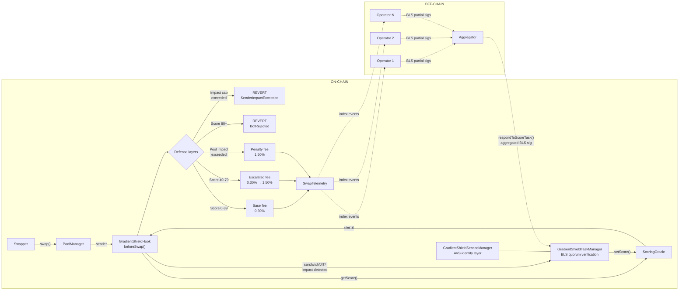
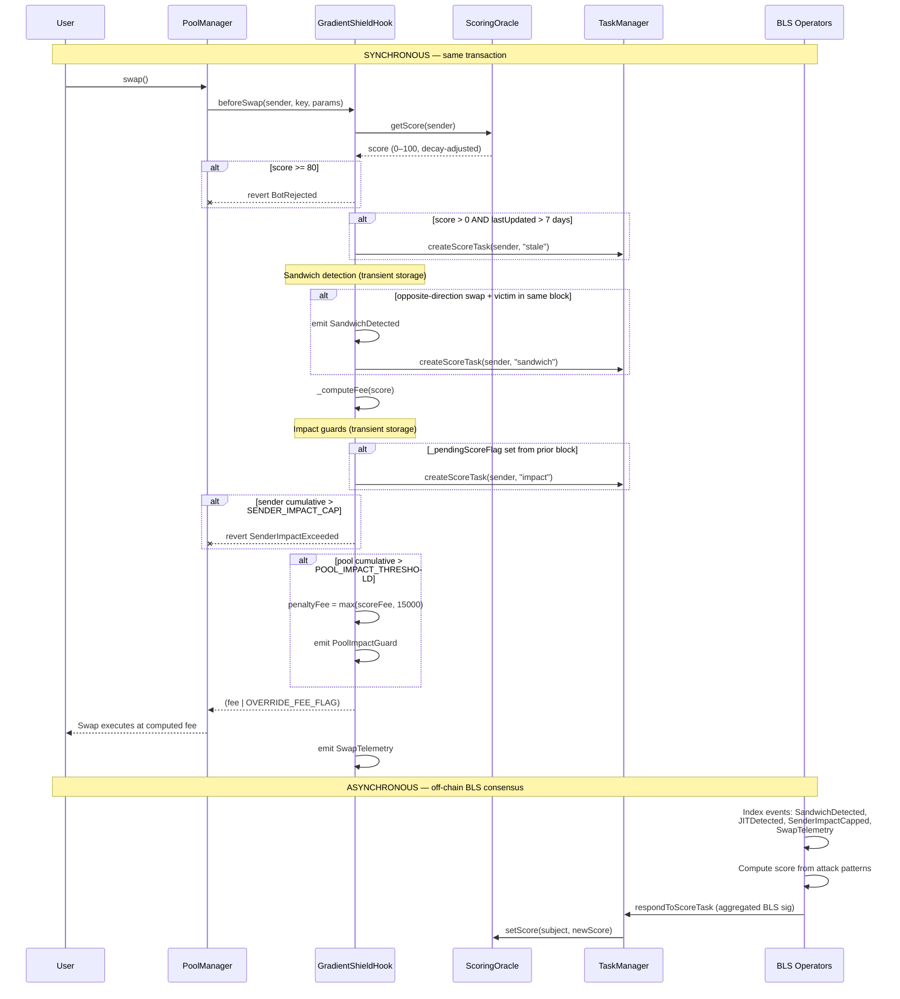

# GradientShield

A Uniswap v4 hook that prices swaps by the swapper's MEV-risk score, enforced by
a BLS multi-operator quorum through an EigenLayer AVS. Suspicious swappers pay an
escalated fee via a continuous fee curve; confirmed toxic flow is rejected outright.

Five defense layers work together to prevent MEV — including **same-block impact
guards** that make sandwich attacks expensive on the very first trade, before any
score exists.

# Project Number : HK-UHI10-1050

> **200 tests passing, 0 skipped** across 16 test suites. Hook logic, BLS task
> manager, oracle decay, sandwich/JIT detection, impact guards, hookData
> attestation, multi-hop ERC6909 settlement, access control, edge cases,
> and the full escalation flow are implemented and tested.

---

## Five defense layers

GradientShield doesn't rely on a single mechanism. Five layers work together so
that even a brand-new address attempting its first sandwich attack is caught and
penalized:

| Layer | When it acts | What it does |
|:-----:|:------------:|--------------|
| **1. Sender Impact Cap** | Same block (first trade) | Limits any single sender to **5 ETH** of volume per pool per block. The back-run leg of a sandwich reverts with `SenderImpactExceeded` when cumulative volume exceeds the cap. |
| **2. Pool Impact Guard** | Same block (first trade) | Tracks cumulative volume across all senders per pool per block. When total volume exceeds **10 ETH**, subsequent swaps pay a **1.50% penalty fee**, making the back-run unprofitable. |
| **3. Sandwich/JIT Detection** | Same block | Uses **transient storage (EIP-1153)** to detect same-block buy→victim→sell patterns and same-block add→swap→remove JIT liquidity. Emits detection events and auto-triggers AVS scoring tasks. |
| **4. Continuous Fee Curve** | Every swap | Maps the sender's **0-100 risk score** onto a fee: clean (0-39) pays 0.30%, suspicious (40-79) pays up to 1.50%, confirmed toxic (80+) is rejected outright. |
| **5. AVS Scoring (BLS Quorum)** | Asynchronous | EigenLayer operators read on-chain detection events, compute scores independently, reach BLS consensus, and write the verified score to the oracle — affecting all future swaps. |

**Key insight:** Layers 1-3 act on the *first ever* trade. No reputation history
needed. Layer 4-5 build long-term memory so repeat offenders face escalating
fees and eventual rejection.

---

## How the first sandwich attack is stopped

```
Block N:
  1. Bot front-runs: buys 4 ETH of token → cumulative = 4 ETH
     Hook sets _pendingScoreFlag (4 ETH > 50% of 5 ETH cap)
  2. Victim swaps: normal trade proceeds at base fee
  3. Bot back-runs: tries to sell 4 ETH → cumulative = 8 ETH > 5 ETH cap
     → REVERTS with SenderImpactExceeded

Block N+1:
  4. Bot tries any swap → hook sees _pendingScoreFlag is set
     → auto-triggers AVS scoring task (ScoreTaskTriggered)
  5. AVS operators read SenderImpactCapped event → score +30-35
     Bot enters suspicious band, pays escalated fees going forward
```

The sandwich is **physically impossible** — the back-run reverts. No score
history, no oracle lookup, no off-chain delay. The cap is enforced by transient
storage at ~100 gas per read/write.

---

## Architecture & data flow



### What happens when a user submits a trade



---

## Continuous fee curve

The hook maps a **continuous 0-100 risk score** onto a **linear fee curve**:

```
fee = BASE_FEE + (MAX_ESCALATED_FEE - BASE_FEE) × (score - 40) / (80 - 40)
```

| Score | Band | Fee (pips) | Behaviour |
|:-----:|:----:|:----------:|-----------|
| **0-39** | Clean | 3000 (0.30%) | Base fee |
| **40** | Suspicious (low) | 3000 (0.30%) | Curve entry |
| **50** | Suspicious | 6000 (0.60%) | 2x base |
| **60** | Suspicious | 9000 (0.90%) | 3x base |
| **75** | Suspicious (high) | 13500 (1.35%) | 4.5x base |
| **80-100** | Confirmed toxic | — | **Reverts** `BotRejected` |

---

## Impact guards (first-trade protection)

These guards use **transient storage** and act on the very first trade — no
reputation history needed.

### Sender impact cap

- **Constant:** `SENDER_IMPACT_CAP = 5 ether`
- Tracks cumulative `abs(amountSpecified)` per sender per pool per block
- **Reverts** with `SenderImpactExceeded` when exceeded
- Prevents the back-run leg of a sandwich from executing
- Independent per sender — one sender's volume doesn't affect another's
- Resets automatically each block (transient storage)

### Pool impact guard

- **Constant:** `POOL_IMPACT_THRESHOLD = 10 ether`
- Tracks cumulative volume across *all* senders per pool per block
- When exceeded, subsequent swaps pay `IMPACT_PENALTY_FEE` (15000 pips = 1.50%)
- Does not revert — applies a penalty fee instead
- Makes large-volume manipulation unprofitable even when split across addresses

### Pending score flag (`_pendingScoreFlag`)

When a sender uses >50% of the impact cap in a single block, the hook sets a
persistent flag. On the sender's *next successful swap* (even in a future block),
the hook auto-triggers an AVS scoring task before clearing the flag. This
bridges the gap between the immediate revert (which rolls back all state) and
the asynchronous AVS scoring pipeline.

---

## AVS scoring algorithm

The operator scores addresses based on **actual attack patterns** observed
on-chain, not transaction count. The operator reads hook events
(`SandwichDetected`, `JITDetected`, `SenderImpactCapped`, `SwapTelemetry`)
and applies weighted scoring:

| Signal | Points | Source |
|--------|:------:|--------|
| Sandwich detected | **+35** per occurrence | `SandwichDetected` event |
| Impact cap hit | **+30** per occurrence | `SenderImpactCapped` event |
| JIT detected | **+25** per occurrence | `JITDetected` event |
| Round-trip ratio >40% | **+20** | `SwapTelemetry` analysis |
| High frequency (10+ swaps) | **+15** | `SwapTelemetry` count |
| Multi-pool activity (3+) | **+10** | Cross-pool event analysis |

**First-offense floor:** Any detection guarantees a minimum score of **35**,
placing the address in the suspicious band immediately.

### Progressive escalation

Scores are **cumulative** — each offense adds to the existing (decayed) score:

| Offense | Score delta | Cumulative | Hook action |
|:-------:|:----------:|:----------:|-------------|
| 1st sandwich | +35 | ~35 | Enters suspicious band, escalated fee |
| 2nd sandwich | +35 | ~70 | Deep suspicious, ~1.25% fee |
| 3rd sandwich | +35 | ~85+ | **REJECTED** — swap reverts |

### Score decay

Scores decay linearly at **5 points per day**. An address scored 85 (rejected)
that stops attacking:
- Day 1: 80 (still rejected)
- Day 2: 75 (suspicious, 1.35% fee)
- Day 9: 40 (border of suspicious, back to base fee)
- Day 17: 0 (fully clean)

This prevents permanent bans — reformed addresses re-enter the pool naturally.

---

## On-chain MEV detection

### Sandwich detection

Flags an address that swaps in **opposite directions within the same block** on
the same pool, with at least one intervening swap by a different address (the
victim).

- Uses transient storage: `_firstSwap` (direction), `_blockSwaps` (count)
- Requires `count >= 2` (victim swapped between) AND opposite direction
- Emits `SandwichDetected(poolId, swapper, blockNumber)`
- Auto-triggers `ScoreTaskTriggered(subject, blockNumber, "sandwich")`

### JIT liquidity detection

Flags an address that adds and removes liquidity **within the same block** on
the same pool.

- Records add-liquidity block in `_liquidityAdds`
- Checks on remove-liquidity if add happened same block
- Emits `JITDetected(poolId, provider, blockNumber)`
- Auto-triggers `ScoreTaskTriggered(subject, blockNumber, "jit")`

### Transient storage (EIP-1153)

All per-block detection state uses **transient storage** (`TSTORE`/`TLOAD`):

| Operation | Regular storage | Transient storage | Savings |
|-----------|:--------------:|:-----------------:|:-------:|
| Write (cold) | 22,100 gas | 100 gas | **99.5%** |
| Write (warm) | 5,000 gas | 100 gas | **98%** |
| Read (cold) | 2,100 gas | 100 gas | **95%** |

Five transient namespaces prevent slot collisions:
- `GradientShield.firstSwap` — sandwich direction tracking
- `GradientShield.blockSwaps` — victim swap counting
- `GradientShield.liquidityAdds` — JIT detection
- `GradientShield.poolImpact` — pool-level volume tracking
- `GradientShield.senderImpact` — per-sender volume tracking

---

## Multi-hop swaps via `unlockCallback` (ERC6909 settlement)

Supports atomic multi-hop swaps (A→B→C→…) through the `unlockCallback` pattern.
Settlement uses **ERC6909 claim tokens** — no ERC-20 approvals to the hook, no
reentrancy risk.

---

## hookData attestation (optional)

Swappers can skip the on-chain oracle `SLOAD` by passing an ECDSA-signed score
attestation in the swap's `hookData`. The attestor signs
`(sender, score, expiry, chainId, hookAddress)` off-chain; the hook verifies
the signature and uses the attested score directly. Falls back to on-chain
oracle when hookData is empty or invalid.

---

## BLS multi-operator quorum

Uses EigenLayer's BLS signature infrastructure for decentralized score consensus.

1. **Task creation:** The hook auto-triggers tasks on sandwich/JIT/impact
   detection. The off-chain generator can also create tasks via `createScoreTask()`.
2. **Operator consensus:** Each operator independently computes a score by
   reading hook events, then signs with their BLS private key.
3. **Aggregation:** The aggregator collects partial BLS signatures and submits
   `respondToScoreTask()` with `NonSignerStakesAndSignature` proof.
4. **On-chain verification:** `BLSSignatureChecker` verifies the aggregated
   BLS signature (~120k gas, constant regardless of operator count).
5. **Score write:** If 67% quorum threshold is met, the score is written to
   `ScoringOracle`. A 100-block challenge window allows disputes.

---

## Known limitations

| Limitation | Why | Mitigation |
|------------|-----|------------|
| **Cross-block sandwich** | Transient storage resets each block, so a buy in block N and sell in block N+1 is not detected | AVS operators can detect cross-block patterns off-chain and score accordingly |
| **Fresh wallet evasion** | Attacker uses a new address for each attack to avoid score accumulation | Impact guards (layers 1-2) still block the back-run on every attempt regardless of address. The cap makes each attempt cost gas with no profit. |
| **Split-router attacks** | Splitting volume across multiple addresses to stay under sender cap | Pool impact guard (layer 2) catches aggregate volume across all senders |
| **Builder-level MEV** | Block builders can reorder transactions outside the hook's visibility | Out of scope for application-layer hooks; requires PBS/inclusion list solutions |

---

## Component responsibilities

| Component | Layer | Responsibility |
|-----------|:-----:|----------------|
| `GradientShieldHook` | on-chain | v4 hook. Reads scores, applies fee curve, detects sandwich/JIT, enforces impact guards, auto-triggers BLS tasks, emits telemetry. |
| `ScoringOracle` | on-chain | Per-address score store with 5-point/day linear decay. Reads open; writes AVS-gated. |
| `GradientShieldTaskManager` | on-chain | BLS task manager. Creates scoring tasks, verifies BLS-aggregated quorum signatures, enforces response/challenge windows. |
| `GradientShieldServiceManager` | on-chain | AVS identity layer. Links to TaskManager, handles EigenLayer registration. |
| AVS Operators | off-chain | Read hook events, compute scores from attack patterns, sign with BLS. |
| Aggregator | off-chain | Collects BLS partial signatures, aggregates, submits to TaskManager. |

---

## Getting started

### Prerequisites

| Tool | Version | Install |
|------|---------|---------|
| **Foundry** (forge, cast, anvil) | Latest | [getfoundry.sh](https://book.getfoundry.sh/getting-started/installation) |
| **Git** | 2.x+ | System package manager |
| **Node.js** (for off-chain operator) | 18+ | [nodejs.org](https://nodejs.org) |

### Clone and build

```bash
git clone --recurse-submodules https://github.com/DecentralizedGlasses/Gradient-Shield.git
cd Gradient-Shield
```

If you already cloned without `--recurse-submodules`:

```bash
git submodule update --init --recursive
```

The project needs **two solc versions** (v4-core requires 0.8.26, EigenLayer
middleware requires 0.8.27). Foundry's `auto_detect_solc = true` handles this
automatically.

```bash
forge build
```

### Run the tests

```bash
forge test -vvv
```

All 200 tests should pass:

| Suite | Tests | What it covers |
|-------|:-----:|----------------|
| `HookEdgeCases.t.sol` | 36 | Edge cases across all hook logic |
| `HookCoverage.t.sol` | 30 | Line coverage for hook paths |
| `ImpactGuard.t.sol` | 24 | Sender cap, pool guard, sandwich blocking, scoring trigger |
| `AccessControl.t.sol` | 22 | Permission and access control checks |
| `TaskManagerAccess.t.sol` | 16 | Task manager permission paths |
| `ScoringOracle.t.sol` | 15 | Decay, bump, access control, ownership |
| `TaskManager.t.sol` | 13 | BLS task lifecycle, response window, challenges |
| `ServiceManager.t.sol` | 8 | Initialization, task manager linking, ownership |
| `HookAttestorCoverage.t.sol` | 7 | Attestor-related hook paths |
| `MEVAttackDefense.t.sol` | 6 | Sandwich/JIT detection, full escalation flow |
| `HookBehavior.t.sol` | 5 | Fee ladder, dynamic fee override, permissions |
| `HookDataAttestation.t.sol` | 5 | ECDSA attestation via hookData, fallback paths |
| `DemoSimulation.t.sol` | 5 | End-to-end scoring scenarios with BLS quorum |
| `MEVSimulation.t.sol` | 4 | MEV attack simulations |
| `MultiHopSwap.t.sol` | 3 | ERC6909 multi-hop settlement |
| `SandwichAttackSim.t.sol` | 1 | Full 6-phase sandwich simulation |

### Run the demo scenarios

Watch the 5-scenario scoring demo with console output:

```bash
forge test --match-path test/DemoSimulation.t.sol -vvv
```

### Set up the off-chain operator (optional)

```bash
cd operator
npm install
```

Create a `.env` file from the example:

```bash
cp .env.example .env
```

Fill in `RPC_URL`, `OPERATOR_PRIVATE_KEY`, `SERVICE_MANAGER_ADDRESS`,
`SCORING_ORACLE_ADDRESS`, and `HOOK_ADDRESS` (printed by the deploy script).

```bash
npm run operator        # start the operator node (watches for tasks)
npm run create-task     # create a scoring task
npm run score           # check/score an address
```

### Makefile shortcuts

```bash
make help               # list all available targets
make install            # install Solidity + Node.js deps
make build              # forge build
make test               # forge test -vvv
make demo               # run the 5-scenario demo
make deploy-sepolia     # deploy to Sepolia (needs env vars)
make operator           # start the off-chain operator node
```

---

## Verification checklist

### Local (Foundry)

```bash
forge test -vvv                                    # all 200 tests pass
forge test --match-path test/ImpactGuard.t.sol -vvv # impact guard tests
forge test --match-path test/SandwichAttackSim.t.sol -vvv # sandwich sim
```

### Fork testing (Sepolia)

```bash
forge test --fork-url $SEPOLIA_RPC -vvv
```

### Testnet deployment

```bash
export PRIVATE_KEY=<key>
export POOL_MANAGER=<sepolia_pool_manager>
forge script script/DeploySepolia.s.sol --rpc-url $SEPOLIA_RPC --broadcast
```

The deploy script outputs all contract addresses. Set them in `operator/.env`
and run `npm run operator` to start watching for scoring tasks.

---

## Deploy

### Sepolia (with mock BLS infrastructure)

```bash
export PRIVATE_KEY=<key>
export POOL_MANAGER=<address>
forge script script/DeploySepolia.s.sol --rpc-url $RPC_URL --broadcast
```

### Mainnet / testnet (with real BLS infrastructure)

Requires EigenLayer core + BLS infrastructure already deployed:

```bash
export PRIVATE_KEY=<key>
export POOL_MANAGER=<address>
export REGISTRY_COORDINATOR=<address>
export STAKE_REGISTRY=<address>
export AVS_DIRECTORY=<address>
export REWARDS_COORDINATOR=<address>
export PERMISSION_CONTROLLER=<address>
export ALLOCATION_MANAGER=<address>
export PAUSER_REGISTRY=<address>
export AGGREGATOR=<aggregator_address>
export GENERATOR=<generator_address>

forge script script/Deploy.s.sol --rpc-url $RPC_URL --broadcast
```

---

## Repository layout

```
.
├── src/
│   ├── GradientShieldHook.sol          v4 hook: fee curve, sandwich/JIT detection,
│   │                                    impact guards, multi-hop, attestation
│   ├── GradientShieldTaskManager.sol   BLS quorum task manager
│   ├── GradientShieldServiceManager.sol AVS service manager (BLS variant)
│   ├── IGradientShieldTaskManager.sol  task manager interface & structs
│   ├── IScoreTaskCreator.sol          lightweight hook→TaskManager interface
│   └── ScoringOracle.sol              per-address score store with decay
├── test/
│   ├── ImpactGuard.t.sol              impact guard tests (24 tests)
│   ├── HookEdgeCases.t.sol            edge cases (36 tests)
│   ├── HookCoverage.t.sol             coverage paths (30 tests)
│   ├── AccessControl.t.sol            permissions (22 tests)
│   ├── TaskManagerAccess.t.sol        task manager access (16 tests)
│   ├── ScoringOracle.t.sol            scoring + decay (15 tests)
│   ├── TaskManager.t.sol              BLS task lifecycle (13 tests)
│   ├── ServiceManager.t.sol           service manager (8 tests)
│   ├── HookAttestorCoverage.t.sol     attestor paths (7 tests)
│   ├── MEVAttackDefense.t.sol         sandwich/JIT/escalation (6 tests)
│   ├── HookBehavior.t.sol             fee ladder (5 tests)
│   ├── HookDataAttestation.t.sol      ECDSA attestation (5 tests)
│   ├── DemoSimulation.t.sol           end-to-end demo (5 tests)
│   ├── MEVSimulation.t.sol            MEV simulations (4 tests)
│   ├── MultiHopSwap.t.sol             multi-hop settlement (3 tests)
│   └── SandwichAttackSim.t.sol        sandwich simulation (1 test)
├── script/
│   ├── Deploy.s.sol                   mainnet deploy with BLS infra
│   ├── DeploySepolia.s.sol            Sepolia deploy with mock BLS
│   └── MineHookAddress.s.sol          CREATE2 hook address miner
├── operator/
│   ├── operator.js                    event-based scoring operator
│   ├── scoreAddress.js                manual address scoring tool
│   ├── createTask.js                  task creation script
│   └── abi/                           contract ABIs for operator
├── lib/                               git-submodule dependencies
├── foundry.toml                       auto_detect_solc, Cancun EVM
├── remappings.txt                     import-path aliases
└── README.md                          this file
```

## Dependency versions

| Dependency | Pinned rev | Why |
|------------|-----------|-----|
| `v4-core` | `59d3ecf` | Has `types/PoolOperation.sol` (`SwapParams`, `ModifyLiquidityParams`) |
| `v4-periphery` | `3779387` | Last commit with `src/utils/BaseHook.sol` (removed in #510) |
| `eigenlayer-middleware` | v1.5 | BLS infrastructure (`BLSSignatureChecker`, `ServiceManagerBase`, `RegistryCoordinator`) |
| `forge-std` | `v1.16.2` | — |

---

## EigenLayer AVS integration

GradientShield is built as an **AVS Builder** submission for the EigenLayer
Hookathon. The AVS architecture follows the
[Incredible Squaring](https://github.com/Layr-Labs/incredible-squaring-avs)
pattern with the following adaptations:

| Incredible Squaring component | GradientShield equivalent |
|-------------------------------|--------------------------|
| `IncredibleSquaringTaskManager` | `GradientShieldTaskManager` — creates scoring tasks, verifies BLS-aggregated quorum signatures |
| `IncredibleSquaringServiceManager` | `GradientShieldServiceManager` — AVS identity layer, operator registration |
| Task: square a number | Task: compute MEV risk score for a flagged address over a block range |
| Off-chain operator logic | `operator/` — indexes hook events, computes scores from attack patterns, signs with BLS |

---

## Acknowledgements

The LP fee redistribution concept and BLS task manager architecture were inspired
by [krisoshea-eth](https://github.com/krisoshea-eth)'s
[MEV-Auction-Hook](https://github.com/krisoshea-eth/MEV-Auction-Hook).
GradientShield takes a different approach — instant swaps with score-based MEV
taxation and same-block impact guards rather than auction-paused execution — but
the BLS quorum pattern for AVS task verification follows a similar structure.
