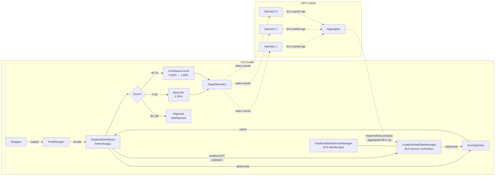
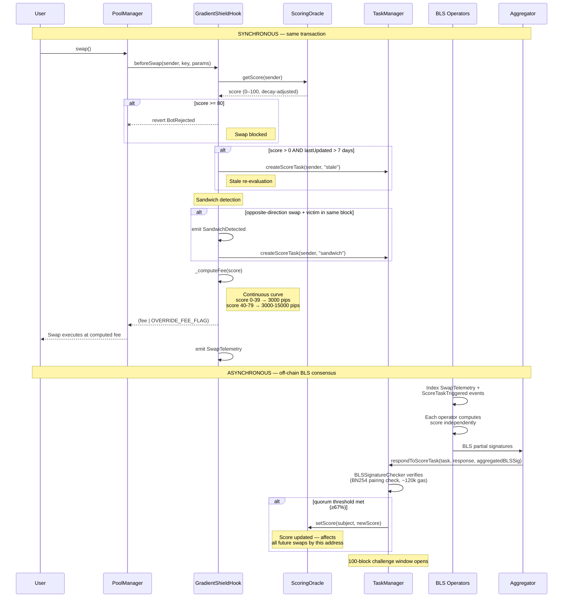

# GradientShield

A Uniswap v4 hook that prices swaps by the swapper's MEV-risk score, enforced by
a BLS multi-operator quorum through an EigenLayer AVS. Suspicious swappers pay an
escalated fee via a continuous fee curve; confirmed toxic flow is rejected outright.
On-chain sandwich and JIT detection use **transient storage (EIP-1153)** for
gas-efficient per-block tracking (~25% gas savings on detection logic).

# Project Number : HK-UHI10-1050

> **52 tests passing, 0 skipped.** Hook logic, BLS task manager, oracle decay,
> sandwich/JIT detection, and the full escalation flow are implemented and tested.

---

## How GradientShield works

Instead of a binary allow/deny, the hook maps a continuous **0-100 risk score**
onto a **continuous fee curve** — clean flow pays the base fee, suspicious flow
pays a linearly escalating fee (up to 5x), and confirmed toxic flow is rejected
outright. The name is the mechanism: a *gradient* that *shields* the pool.

Three systems work together:

1. **On-chain hook (BLS-integrated):** `GradientShieldHook` runs inside the
   PoolManager's `beforeSwap` callback. It reads scores from the
   `ScoringOracle`, makes a fee decision, detects sandwich/JIT patterns, and
   **auto-triggers BLS scoring tasks** on the `TaskManager` when patterns
   are detected — closing the detection→quorum→scoring feedback loop on-chain.

2. **On-chain BLS task manager (consensus):** `GradientShieldTaskManager` accepts
   scoring tasks from both the off-chain generator **and the hook itself**,
   then verifies BLS-aggregated signatures from the operator quorum via
   `BLSSignatureChecker`. A 100-block challenge window allows disputes before
   a score becomes final.

3. **Off-chain (the feedback loop):** EigenLayer AVS operators index the emitted
   `SwapTelemetry` and `ScoreTaskTriggered` events, independently compute
   MEV/sandwich scores, reach BLS consensus off-chain, and the aggregator
   submits the verified score to the oracle.

### Architecture & data flow



### What happens when a user submits a trade

Every swap through a GradientShield-protected pool follows this path:



**Step-by-step breakdown:**

| Step | Where | What happens | Gas impact |
|:----:|:-----:|--------------|:----------:|
| **1** | PoolManager | User calls `swap()`. PoolManager invokes the hook's `beforeSwap` callback. | — |
| **2** | Hook → Oracle | Hook calls `oracle.getScore(sender)` — returns the decay-adjusted score (0–100). | ~5k |
| **3** | Hook | **Score >= 80?** Swap reverts with `BotRejected`. The transaction fails — no tokens move. | — |
| **4** | Hook → Oracle | **Stale check:** If score > 0 and `lastUpdated` is older than 7 days, triggers a BLS re-evaluation task. | ~50k if triggered |
| **5** | Hook | **Sandwich detection (transient storage):** Uses `TLOAD`/`TSTORE` to check if this sender already swapped the same pool in the opposite direction this block, with a victim swap in between. If yes, emits `SandwichDetected` and triggers a BLS task (rate-limited: 1 per address per 50 blocks). | ~200 detection + ~50k if task triggered |
| **6** | Hook | **Fee calculation:** `_computeFee(score)` applies the continuous curve. Score 0–39 pays 3000 pips (0.30%). Score 40–79 scales linearly up to 15000 pips (1.50%). | ~200 |
| **7** | Hook → PoolManager | Returns the computed fee with `OVERRIDE_FEE_FLAG`. PoolManager executes the swap at that exact fee. LPs collect the fee. | — |
| **8** | Hook | Emits `SwapTelemetry` with poolId, sender, direction, amount, score, fee, and block number. | ~2k |
| **9** | Off-chain | AVS operators index `SwapTelemetry` and `ScoreTaskTriggered` events, independently compute a score for the flagged address, and sign with their BLS private keys. | — |
| **10** | Off-chain → TaskManager | Aggregator collects partial BLS signatures, aggregates them, and submits `respondToScoreTask()`. The `BLSSignatureChecker` verifies the aggregated signature on-chain (~120k gas, constant regardless of operator count). | ~120k |
| **11** | TaskManager → Oracle | If the quorum threshold (67%) is met, the score is written to the oracle. A 100-block challenge window opens for disputes. | ~25k |
| **12** | Next swap | The updated score immediately affects this address's fee on all subsequent swaps across all GradientShield pools. | — |

> **Key insight:** Detection and fee decisions are **synchronous** (same transaction, ~10k gas overhead).
> Score updates are **asynchronous** (BLS quorum responds within 100 blocks).
> The hook creates the feedback loop — it detects, triggers the quorum, and the quorum's response changes future fee decisions.

---

### Continuous fee curve

Instead of a flat multiplier, the hook applies a **continuous linear fee curve**
across the suspicious band. The fee rises smoothly from `BASE_FEE` (3000 pips)
at score 40 to `MAX_ESCALATED_FEE` (15000 pips) at score 79:

```
fee = BASE_FEE + (MAX_ESCALATED_FEE - BASE_FEE) × (score - 40) / (80 - 40)
```

| Score | Band | Fee (pips) | Behaviour | Events |
|:-----:|:----:|:----------:|-----------|--------|
| **0-39** | Clean | 3000 (0.30%) | Base fee | `SwapTelemetry` |
| **40** | Suspicious (low) | 3000 (0.30%) | Curve entry | `FeeEscalated`, `SwapTelemetry` |
| **50** | Suspicious | 6000 (0.60%) | 2x base | `FeeEscalated`, `SwapTelemetry` |
| **60** | Suspicious | 9000 (0.90%) | 3x base | `FeeEscalated`, `SwapTelemetry` |
| **75** | Suspicious (high) | 13500 (1.35%) | 4.5x base | `FeeEscalated`, `SwapTelemetry` |
| **80-100** | Confirmed toxic | — | **Reverts** `BotRejected` | `BotRejectedEvent` |

### Score decay

Scores decay linearly at **5 points per day**. An address scored 85 (rejected)
that stops attacking will:
- Day 1: 80 (still rejected)
- Day 2: 75 (suspicious, 13500 pips = 4.5x fee)
- Day 9: 40 (border of suspicious, back to base fee)
- Day 17: 0 (fully clean)

This prevents permanent bans and lets reformed addresses re-enter the pool.

---

## On-chain MEV detection

The hook detects two MEV patterns directly on-chain. When a pattern is
detected, the hook **auto-triggers a BLS scoring task** on the TaskManager
(rate-limited to one task per address per 50 blocks via `TASK_COOLDOWN_BLOCKS`).

### Sandwich detection

Flags an address that swaps in **opposite directions within the same block** on
the same pool, with at least one intervening swap by a different address (the
victim). This catches the classic front-run/back-run pattern.

- Tracks per-pool, per-address first-swap direction (`_firstSwap`)
- Counts total swaps per pool per block (`_blockSwaps`)
- Requires `count >= 2` (victim swapped between) AND opposite direction
- Emits `SandwichDetected(poolId, swapper, blockNumber)`
- Auto-triggers `ScoreTaskTriggered(subject, blockNumber, "sandwich")`

### JIT liquidity detection

Flags an address that adds and removes liquidity **within the same block** on
the same pool — the hallmark of just-in-time liquidity provision that extracts
value from pending swaps.

- Records add-liquidity block per (pool, provider) in `_liquidityAdds`
- Checks on remove-liquidity if add happened same block
- Emits `JITDetected(poolId, provider, blockNumber)`
- Auto-triggers `ScoreTaskTriggered(subject, blockNumber, "jit")`

### Stale score re-evaluation

If a swapper has a non-zero score that was last updated more than 7 days ago
(`STALENESS_THRESHOLD`), the hook auto-triggers a BLS re-evaluation task
(`ScoreTaskTriggered(subject, blockNumber, "stale")`). This ensures scores
reflect the current quorum consensus, not just historical data.

### Transient storage (EIP-1153)

All per-block detection state uses **transient storage** (`TSTORE`/`TLOAD`)
instead of regular storage (`SSTORE`/`SLOAD`). This is a natural fit because
sandwich and JIT tracking data is only relevant within the current block —
it never needs to persist across transactions.

| Operation | Regular storage | Transient storage | Savings |
|-----------|:--------------:|:-----------------:|:-------:|
| Write (cold) | 22,100 gas | 100 gas | **99.5%** |
| Write (warm) | 5,000 gas | 100 gas | **98%** |
| Read (cold) | 2,100 gas | 100 gas | **95%** |
| Read (warm) | 100 gas | 100 gas | — |

Measured gas savings on detection tests:

| Test | Before | After | Saved |
|------|:------:|:-----:|:-----:|
| Sandwich detected | 449,235 | 317,426 | **29%** |
| JIT detected | 443,168 | 333,491 | **25%** |
| Full escalation flow | 585,424 | 453,376 | **23%** |

Three transient namespaces keyed by `(poolId, sender, block.number)`:
- **`GradientShield.firstSwap`** — records the first swap direction per
  (pool, swapper) for sandwich back-run detection
- **`GradientShield.blockSwaps`** — counts total swaps per pool to confirm
  an intervening victim swap
- **`GradientShield.liquidityAdds`** — flags add-liquidity for same-block
  JIT removal detection

Only `_lastTaskBlock` (task rate-limiting) uses persistent storage since it
must survive across transactions.

---

## BLS multi-operator quorum

GradientShield uses EigenLayer's BLS signature infrastructure for decentralized
score consensus. Multiple operators must independently agree on a score before
it can be written on-chain.

### How scoring works

1. **Task creation:** Tasks are created by two sources: the **hook itself**
   (auto-triggered when sandwich or JIT patterns are detected on-chain) and
   the **generator** (off-chain watcher) via `createScoreTask()`. Both paths
   feed into the same BLS quorum pipeline.

2. **Operator consensus:** Each registered operator independently computes a
   score for the target address over the specified block range. They sign the
   response with their BLS private key.

3. **Aggregation:** The aggregator collects BLS partial signatures, aggregates
   them into a single signature, and submits `respondToScoreTask()` with the
   `NonSignerStakesAndSignature` proof.

4. **On-chain verification:** The `BLSSignatureChecker` (inherited from
   EigenLayer middleware) verifies:
   - The aggregated BLS signature is valid (BN254 pairing check)
   - The signed stake meets the quorum threshold percentage
   - The response is within the `TASK_RESPONSE_WINDOW_BLOCK` (100 blocks)

5. **Score write:** If verification passes, the score is written to the
   `ScoringOracle`, immediately affecting all subsequent swaps.

### Challenge mechanism

After a score is submitted, anyone can dispute it within
`TASK_CHALLENGE_WINDOW_BLOCK` (100 blocks) by calling
`raiseAndResolveChallenge()`. A successful challenge:
- Invalidates the task response
- Resets the subject's score to 0
- Emits `TaskChallengedSuccessfully`

The challenge verifies that the non-signer pubkey hashes match the stored
signatory record, proving the quorum was not properly formed.

### Hook ↔ BLS auto-trigger

When the hook detects a sandwich or JIT pattern on-chain, it automatically
creates a scoring task on the `TaskManager` via `IScoreTaskCreator`. This
closes the feedback loop: on-chain detection → BLS quorum evaluation →
score update → fee adjustment on subsequent swaps.

- The hook is registered as a task creator on the TaskManager via
  `setHookAddress()` during deployment
- Task creation is wrapped in `try/catch` — if it fails (TaskManager
  paused, not registered, etc.), the swap still proceeds normally
- **Per-address rate limiting:** one task per address per 50 blocks
  (`TASK_COOLDOWN_BLOCKS`) prevents task spam from repeated detections
- **Stale score re-evaluation:** scores not refreshed in 7 days
  (`STALENESS_THRESHOLD`) auto-trigger a BLS re-evaluation on the next swap
- 10-block lookback window (`DETECTION_LOOKBACK`) and 67% quorum threshold
  (`DETECTION_QUORUM_THRESHOLD`) for auto-created tasks
- A lightweight `IScoreTaskCreator` interface avoids pulling BLS/EigenLayer
  dependencies into the hook's compilation unit (solc 0.8.26 vs 0.8.27)

### Why BLS over ECDSA

| Property | ECDSA (single operator) | BLS (multi-operator quorum) |
|----------|------------------------|----------------------------|
| Trust model | One operator, one key | N operators must agree |
| Verification cost | ~30k gas per operator | ~120k gas total (constant) |
| Signature size | Grows linearly with N | Constant (one G1 point) |
| Collusion resistance | None | Requires threshold fraction |

---

## Component responsibilities

| Component | Layer | Responsibility |
|-----------|:-----:|----------------|
| `GradientShieldHook` | on-chain | The v4 hook. Reads scores, applies a **continuous fee curve**, detects sandwich/JIT patterns on-chain, **auto-triggers BLS scoring tasks** on detection (rate-limited, with stale-score re-evaluation), emits telemetry. |
| `ScoringOracle` | on-chain | Stores one score per address with daily linear decay. Reads are open; writes are AVS-gated (`setScore` / `bumpScore`). |
| `GradientShieldTaskManager` | on-chain | BLS task manager. Creates scoring tasks, verifies BLS-aggregated quorum signatures via `BLSSignatureChecker`, enforces response windows and challenge periods. |
| `GradientShieldServiceManager` | on-chain | AVS identity layer extending `ServiceManagerBase`. Links to the TaskManager, handles EigenLayer registration and rewards. |
| `PoolManager` | on-chain | Uniswap v4-core. Invokes the hook and honours dynamic-fee overrides. |
| AVS Operators | off-chain | EigenLayer operators with BLS keys. Index `SwapTelemetry`, compute scores, sign with BLS. |
| Aggregator | off-chain | Collects BLS partial signatures, aggregates, and submits to the TaskManager. |

---

## Getting started (local reproduction)

### Prerequisites

| Tool | Version | Install |
|------|---------|---------|
| **Foundry** (forge, cast, anvil) | Latest | [getfoundry.sh](https://book.getfoundry.sh/getting-started/installation) |
| **Git** | 2.x+ | System package manager |
| **Node.js** (for off-chain operator) | 18+ | [nodejs.org](https://nodejs.org) |

### Step 1 — Clone the repository

```bash
git clone --recurse-submodules https://github.com/sivajialla/gradient-shield.git
cd gradient-shield
```

If you already cloned without `--recurse-submodules`:

```bash
git submodule update --init --recursive
```

### Step 2 — Install Solidity compilers

The project needs **two solc versions** (v4-core requires 0.8.26, EigenLayer
middleware requires 0.8.27). Foundry's `auto_detect_solc = true` handles this
automatically — it downloads the right compiler per file. No manual solc install
needed if you have internet access during the first build.

If you're on macOS and solc auto-download fails, install them manually:

```bash
# Download solc 0.8.26
curl -L https://github.com/ethereum/solidity/releases/download/v0.8.26/solc-macos \
  -o ~/.svm/0.8.26/solc-0.8.26 && chmod +x ~/.svm/0.8.26/solc-0.8.26

# Download solc 0.8.27
curl -L https://github.com/ethereum/solidity/releases/download/v0.8.27/solc-macos \
  -o ~/.svm/0.8.27/solc-0.8.27 && chmod +x ~/.svm/0.8.27/solc-0.8.27
```

### Step 3 — Build

```bash
forge build
```

First build takes ~30-60 seconds as it compiles all dependencies (v4-core,
eigenlayer-middleware, OpenZeppelin). Subsequent builds are incremental.

### Step 4 — Run the tests

```bash
forge test -vvv
```

All 52 tests should pass:

| Suite | Tests | What it covers |
|-------|:-----:|----------------|
| `ScoringOracle.t.sol` | 15 | Decay, bump, access control, ownership |
| `TaskManager.t.sol` | 11 | BLS task lifecycle, response window, challenges |
| `ServiceManager.t.sol` | 8 | Initialization, task manager linking, ownership |
| `HookBehavior.t.sol` | 5 | Fee ladder, dynamic fee override, permissions |
| `MEVAttackDefense.t.sol` | 6 | Sandwich/JIT detection, full escalation flow |
| `DemoSimulation.t.sol` | 5 | End-to-end scoring scenarios with BLS quorum |

### Step 5 — Run the demo scenarios

Watch the 5-scenario scoring demo with console output:

```bash
forge test --match-path test/DemoSimulation.t.sol -vvv
```

This shows clean traders, occasional MEV extractors, persistent sandwich bots,
reformed bots decaying back to clean, and a side-by-side comparison — all scored
through the BLS quorum flow.

### Step 6 — Set up the off-chain operator (optional)

The `operator/` directory contains a Node.js operator that watches for scoring
tasks and submits responses. To set it up:

```bash
cd operator
npm install
```

Create a `.env` file in the `operator/` directory:

```env
PRIVATE_KEY=<your_private_key>
RPC_URL=<sepolia_rpc_url>
SERVICE_MANAGER_ADDRESS=<deployed_service_manager_address>
TASK_MANAGER_ADDRESS=<deployed_task_manager_address>
ORACLE_ADDRESS=<deployed_oracle_address>
```

Run the operator:

```bash
npm run operator        # start the operator node (watches for tasks)
npm run create-task     # create a scoring task
npm run score           # check an address's current score
```

### Makefile shortcuts

```bash
make help               # list all available targets
make build              # forge build
make test               # forge test -vvv
make demo               # run the 5-scenario demo
make fmt                # format Solidity sources
make clean              # remove build artifacts
make deploy             # deploy to testnet (needs env vars)
```

### Troubleshooting

| Problem | Fix |
|---------|-----|
| `submodule not found` | Run `git submodule update --init --recursive` |
| `solc 0.8.26 not found` | See Step 2 above for manual solc install |
| `HookAddressNotValid` | The hook address must encode permission flags in its bottom 14 bits — `HookMiner.find()` handles this via CREATE2 salt mining |
| `Stack too deep` | Some deploy scripts need `--via-ir` — run `forge script ... --via-ir` |
| Tests fail with `EvmError: Revert` | Make sure submodules are at the pinned revisions — `git submodule update --init --recursive` |

## Repository layout

```
.
├── src/
│   ├── GradientShieldHook.sol          v4 hook with sandwich/JIT detection
│   ├── GradientShieldTaskManager.sol   BLS quorum task manager
│   ├── GradientShieldServiceManager.sol AVS service manager (BLS variant)
│   ├── IGradientShieldTaskManager.sol  task manager interface & structs
│   ├── IScoreTaskCreator.sol          lightweight hook→TaskManager interface
│   └── ScoringOracle.sol              per-address score store with decay
├── test/
│   ├── HookBehavior.t.sol             hook fee-ladder tests
│   ├── MEVAttackDefense.t.sol         sandwich/JIT/escalation tests
│   ├── ScoringOracle.t.sol            scoring + decay tests
│   ├── TaskManager.t.sol              BLS task lifecycle tests
│   ├── ServiceManager.t.sol           service manager tests
│   └── DemoSimulation.t.sol           end-to-end demo scenarios
├── script/
│   ├── Deploy.s.sol                   mainnet deploy with BLS infra
│   └── DeploySepolia.s.sol            Sepolia deploy with mock BLS
├── operator/                          off-chain operator node (Node.js)
├── lib/                               git-submodule dependencies
├── foundry.toml                       auto_detect_solc, Cancun EVM
├── remappings.txt                     import-path aliases
└── README.md                          this file
```

## Multi-solc compilation

The project uses `auto_detect_solc = true` in `foundry.toml` because:
- Uniswap v4-core requires **exactly solc 0.8.26**
- EigenLayer middleware requires **solc ^0.8.27**

Foundry automatically resolves the correct compiler per file based on pragma
declarations. Project source files use `pragma ^0.8.26` to compile with either
version.

## Dependency versions

| Dependency | Pinned rev | Why |
|------------|-----------|-----|
| `v4-core` | `59d3ecf` | Has `types/PoolOperation.sol` (`SwapParams`, `ModifyLiquidityParams`) |
| `v4-periphery` | `3779387` | Last commit with `src/utils/BaseHook.sol` (removed in #510) |
| `eigenlayer-middleware` | v1.5 | BLS infrastructure (`BLSSignatureChecker`, `ServiceManagerBase`, `RegistryCoordinator`) |
| `forge-std` | `v1.16.2` | -- |

## Deploy

### Mainnet / testnet (with real BLS infrastructure)

Requires EigenLayer core + BLS infrastructure (RegistryCoordinator, BLSApkRegistry,
StakeRegistry) already deployed on the target chain.

```bash
export PRIVATE_KEY=<key>
export POOL_MANAGER=<address>
export REGISTRY_COORDINATOR=<address>
export STAKE_REGISTRY=<address>
export AVS_DIRECTORY=<address>
export REWARDS_COORDINATOR=<address>
export PERMISSION_CONTROLLER=<address>
export ALLOCATION_MANAGER=<address>
export PAUSER_REGISTRY=<address>
export AGGREGATOR=<aggregator_address>
export GENERATOR=<generator_address>

forge script script/Deploy.s.sol --rpc-url $RPC_URL --broadcast
```

### Sepolia (with mock infrastructure)

Deploys mock BLS infrastructure for testing without real operator stake:

```bash
export PRIVATE_KEY=<key>
forge script script/DeploySepolia.s.sol --rpc-url $RPC_URL --broadcast
```

---

## Acknowledgements

The LP fee redistribution concept and BLS task manager architecture were inspired
by [krisoshea-eth](https://github.com/krisoshea-eth)'s
[MEV-Auction-Hook](https://github.com/krisoshea-eth/MEV-Auction-Hook).
GradientShield takes a different approach — instant swaps with score-based MEV
taxation rather than auction-paused execution — but the BLS quorum pattern for
AVS task verification follows a similar structure. Credit and thanks to the
original author.
